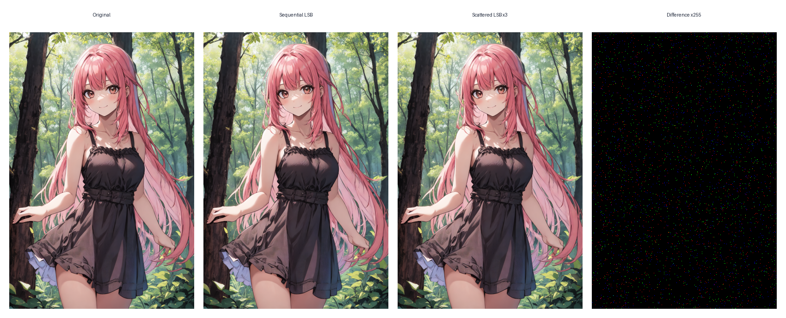
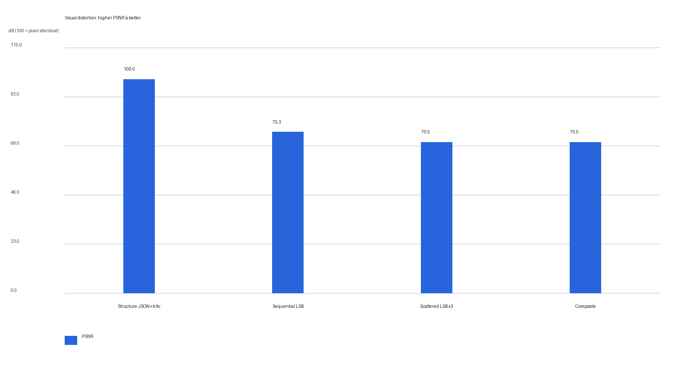
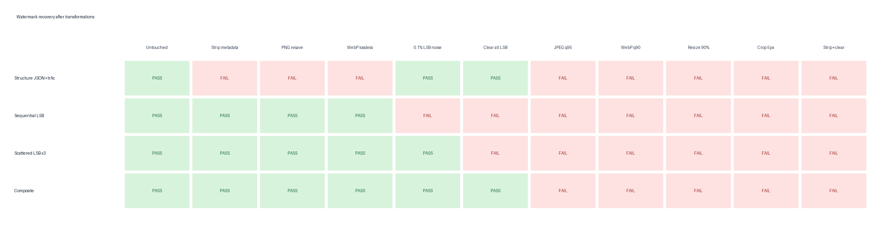
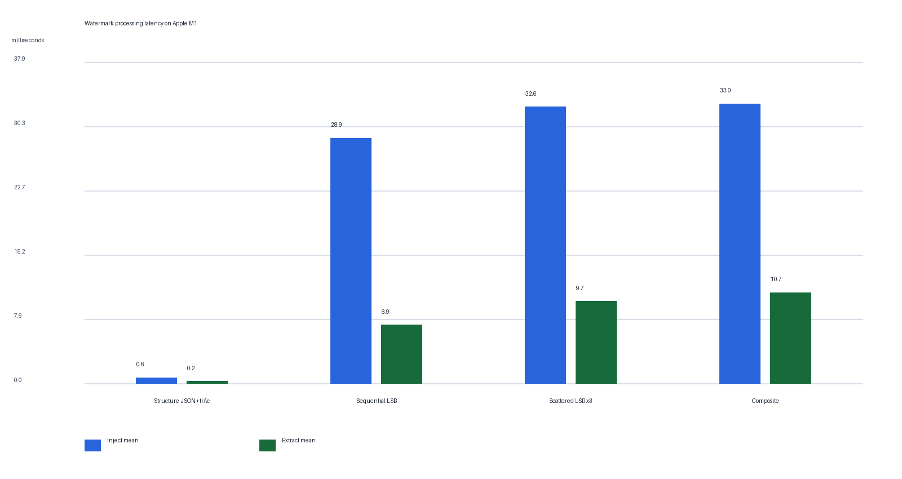
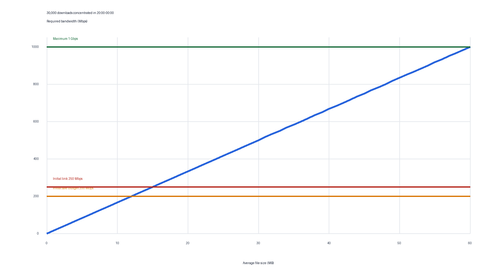

# LSB 像素水印对比实验

实验日期：2026-08-28  
真实样本：`default_Seraphina.png`（400×600 RGBA，600890 bytes）  
加密信封：328 bytes  
实验依赖：Pillow（仅位于 `watermark-experiment` 可选依赖）

## 当前结论

- 简单 LSB 对肉眼观感几乎没有影响，但只能抵抗 Metadata 清理和保持像素值的无损重保存。
- 顺序 LSB 遇到 0.1% 的稀疏最低位扰动即校验失败；密钥散布加三重复多数表决可通过该测试。
- 两种 LSB 都无法抵抗 JPEG、有损 WebP、缩放、裁剪、统一清零最低位或换图。
- `JSON + trAc + 散布 LSB×3` 的复合版本能覆盖更多非恶意处理路径，但主动执行“清 Metadata + 清 LSB”仍可完全移除。
- 角色卡的核心资产是 Prompt/世界书。图片 LSB 只能作为附加线索，不能取代 JSON 中的自包含加密凭证。

## 实验方案

1. `Structure JSON+trAc`：现有双层结构水印，像素不变。
2. `Sequential LSB`：把完整 AES-GCM 信封顺序写入 RGB 最低位。
3. `Scattered LSB×3`：通过密钥确定散布位置，每个逻辑位重复三次并多数表决。
4. `Composite`：结构水印与散布 LSB×3 同时存在。

LSB 只修改 RGB，Alpha 通道保持不变。载荷包含 Magic、协议版本、长度和 CRC32；恢复后还必须通过 AES-GCM 与 Card ID 校验。

## 视觉差异



| 方案 | PSNR | 变化像素 | 输出大小 |
|---|---:|---:|---:|
| Structure JSON+trAc | 像素完全一致 | 0 | 602158 bytes |
| Sequential LSB | 75.33 dB | 789 | 515925 bytes |
| Scattered LSB x3 | 70.54 dB | 4115 | 516562 bytes |
| Composite | 70.54 dB | 4115 | 517830 bytes |



`Scattered LSB×3` 改变 4115 个像素，但每个通道最多只变化 1，PSNR 仍为 70.54 dB。差异需要放大255倍才容易观察。

## 破坏存活矩阵



需要注意：Metadata 被完全清理后，原本存放 Prompt 的 `chara/ccv3` 也会消失，文件已经不再是完整可导入的角色卡。此时 LSB 的“存活”只代表仍可从图片样本提取身份凭证。

## 性能

Apple M1、Python 3.12.9，真实600 KB样本，每项预热5次后运行80轮：

| 方案 | 注入平均 | 注入P95 | 提取平均 |
|---|---:|---:|---:|
| Structure JSON+trAc | 0.64 ms | 0.85 ms | 0.20 ms |
| Sequential LSB | 28.93 ms | 31.57 ms | 6.88 ms |
| Scattered LSB x3 | 32.61 ms | 35.81 ms | 9.67 ms |
| Composite | 32.96 ms | 35.28 ms | 10.68 ms |



复合方案平均注入约 32.96 ms，即当前单核约 30.3 张/秒。像素PNG解码和重新编码是主要成本，AES-GCM与结构Chunk成本很小。

## 每日3万次、集中20:00–00:00的容量模型

这里按3万次全部均匀落在4小时内计算，平均为 2.083 次/秒：

- 当前600 KB样本需要约 10.01 Mbps。
- 初始250 Mbps理论上支持平均约 15.0 MB的资源。
- 按只使用80%带宽的200 Mbps安全预算，平均资源应不超过 12.0 MB。
- 带宽增长到1 Gbps后，理论平均资源上限约 60.0 MB。



该模型只是4小时均匀基线。如果实际下载集中在其中几十分钟，应继续采集每分钟请求峰值，而不能只使用4小时平均值。

## 可复现命令

```bash
uv run --extra watermark-experiment python -m Watermark.run_lsb_experiment
uv run --extra watermark-experiment --extra test pytest -q tests/test_lsb_watermark.py tests/test_watermark.py
```

原始机器数据见 `results.json`，完整破坏矩阵见 `survival.csv`。
